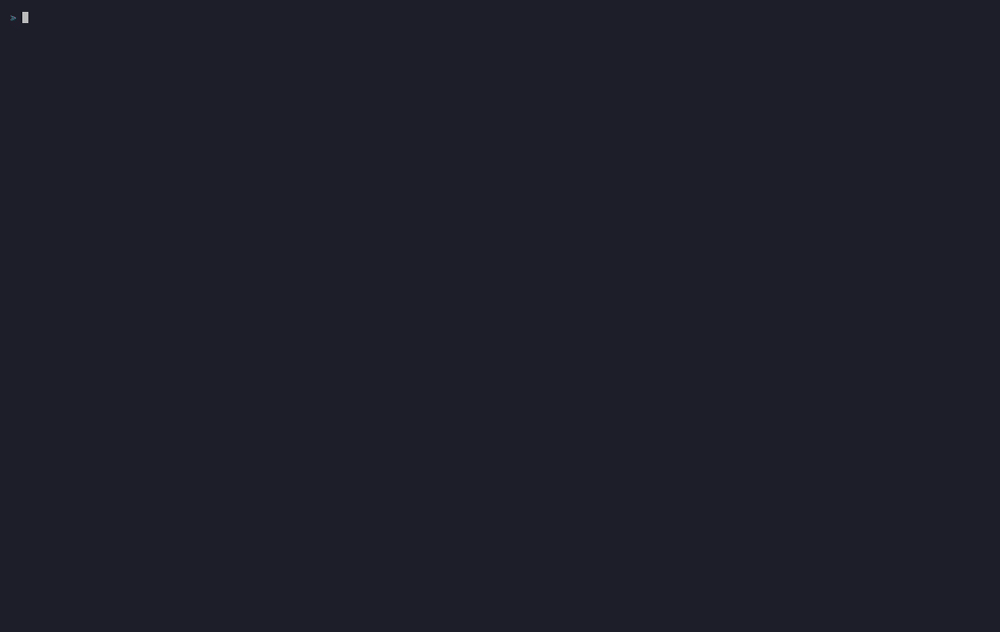
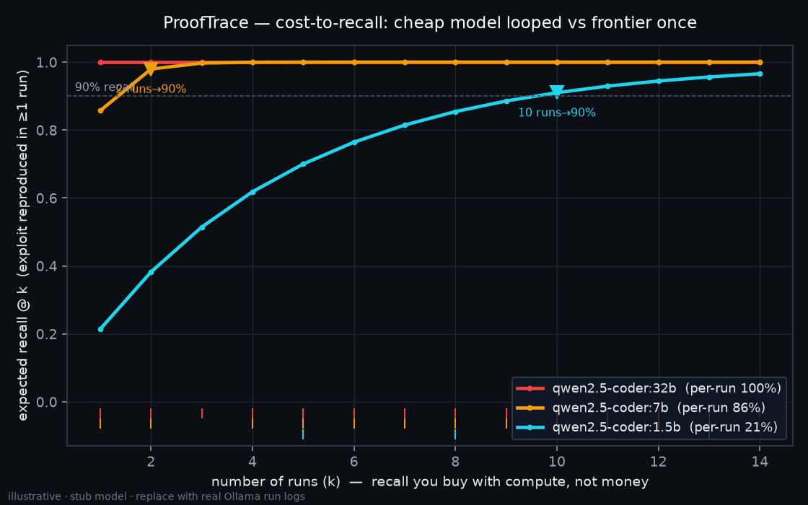

# ProofTrace

**An exploitability-first security review agent. It analyzes a pull request,
builds a source-to-sink reachability graph for the changed code, runs a
LangGraph investigation over that graph, and validates exploitability against a
live instance in Docker before reporting anything. A finding is only reported
once there is a proof.**

It is a deliberate miniature of the kind of pipeline Hacktron describes in
[*Why Mythos doesn't matter*](https://hacktron.ai): static graph construction
and context enrichment for **recall**, then a validation gate for **precision** —
with the LLM as the **investigator over the graph, not the oracle** that decides.
The cost-to-recall experiment below reproduces, in miniature, the finding that a
small model run repeatedly can match a frontier model's recall at a fraction of
the cost.

**100% local. No API key.** The investigator is a local open-weight model served
by [Ollama](https://ollama.com); when no model is present, a deterministic
offline investigator drives the exact same pipeline so the demo, the tests, and
CI never stall.



---

## The one line

> I didn't just make an agent find a bug. I rebuilt a miniature of the Hacktron
> pipeline — statically-built reachability, LLM-as-investigator, a validation
> gate — and then measured **cost-to-recall** across models the way the Mythos
> post does, so I could show that a small model looped converges on the same
> **proven** finding for a fraction of the cost.

**PoC || GTFO.** The climax is a reproduced exploit — user A reading user B's
invoice, live — not an LLM opinion.

---

## Quickstart

```bash
make setup           # uv sync + a clean docker config for anonymous pulls
make demo            # the self-running demo (Ollama if present, else stub)
```

That one command runs the whole thing on the seeded PR: it streams the live
investigation in the terminal, renders the reachability graph, posts the proof
as a PR comment, and plots the cost-to-recall curve — no clicks, no key.

Other entry points:

```bash
make analyze         # run the investigation, write artifacts + the PR comment
make graph           # render the source->sink graph (DOT + SVG)
make cost            # run the cost-to-recall experiment and plot the curve
make watch           # continuous review: re-run the gate on every change
make test            # the back-to-back test suite
make record          # re-record demo/prooftrace.gif with VHS (deterministic)
make target-up       # run the vulnerable target app in Docker (docker compose up)
```

To use the real local model instead of the deterministic stub:

```bash
make pull-models     # ollama pull qwen2.5-coder:7b + :1.5b
make demo            # now the investigator is the real local model
```

---

## How it works

```
   PR diff
     │
     ▼
 [tree-sitter]   parse changed files → routes, sources (path params),
     │           sinks (db.execute), sanitizers (auth), call edges
     ▼
 [reachability]  is there an attacker-controlled source → sink path with
     │           NO ownership check?  (authentication ≠ authorization)
     ▼                                            ── RECALL is built here ──
 [LangGraph]     context → hypothesis → reachability-checker → exploit-planner
     │             the LLM only *investigates*; the graph confirms or rejects
     ▼
 [validator]     spin up the app in Docker, run the exploit live:
     │           user A's token fetches user B's invoice → binary pass
     ▼                                            ── PRECISION is earned here ──
 [proof]         VERIFIED + HTTP transcript + flag → PR comment
```

Temporal is the durable rail around every stage (retries on the LLM and sandbox
steps, a cost ledger per run) and the executor that **fans the cheap model out
N times** for the cost-to-recall experiment.

**The one design claim:** the LLM sits only in the LangGraph box, reasoning over
a graph it did not build, and nothing is reported until the validator reproduces
the exploit. The static graph proposes; validation disposes; the LLM
investigates in between. That is the whole difference between this and "ChatGPT
reviews your PR" — and `tests/test_investigation.py::test_graph_rejects_hallucinated_target`
proves a lying model cannot manufacture a VERIFIED finding.

### The vulnerability

Broken Object Level Authorization (BOLA / IDOR, **CWE-639**). It cannot be found
by pattern matching — the SQL is parameterized and the endpoint is
authenticated; the bug is the *absence of an ownership check*. The target app
ships a safe endpoint of the **same shape** (`/api/invoices/{id}/secure`, with an
ownership filter) that the engine correctly **clears** — precision, not just the
ability to shout "vuln."

```python
@app.get("/api/invoices/{invoice_id}")
def get_invoice(invoice_id: int, user: str = Depends(authenticate)) -> dict:
    row = db.execute("SELECT * FROM invoices WHERE id = :id",
                     {"id": invoice_id}).fetchone()
    # BUG (CWE-639): no check that row["owner_id"] == user
    return dict(row)
```

The target is structured as a [HackBench](https://hackbench.ai)-style challenge
— a Dockerized app with a planted flag (`target_app/challenge.json`) — which
ProofTrace solves end to end.

---

## The cost-to-recall twist



ProofTrace has the two things needed to reproduce the Mythos argument in
miniature: a **deterministic validator** (ground truth — the exploit either
reproduced or it didn't) and a **Temporal fan-out** with a cost ledger. So it
runs the hypothesis stage many times across models, logs per-run hit/miss, and
plots **recall at k runs**. Locally dollars-per-run ≈ 0, so the x-axis becomes
*number of runs* — recall you buy with compute, not money.

> The frontier-class model hits on the first run; the cheap model hits ~1 run in
> 5, but looped it converges on the same **proven** finding by ~10 runs.

The committed chart is generated from stub logs and labelled **illustrative** —
run `make cost` with `make pull-models` done to regenerate it from real local
model runs.

---

## Temporal

```bash
make temporal        # dev server (Web UI :8233) + worker + trigger the workflow
```

Each stage is a retried activity; a cost/token ledger accrues across stages; the
Web UI shows the workflow history. `CostToRecallWorkflow` is the honest
motivation for Temporal — durable fan-out of many cheap runs with per-run
retries, the cost-to-recall thesis made executable.

---

## Continuous review

```bash
make watch           # re-runs the full gate on every change to the target
```

Or as CI: `.github/workflows/security.yml` runs the same review and can be
executed locally with [`act`](https://github.com/nektos/act) — no token, no CI
service. The message: this isn't a one-shot script, it's a gate that runs on
every change.

---

## Layout

| path | what |
|------|------|
| `target_app/` | the ~150-line vulnerable FastAPI app + Dockerfile + `challenge.json` |
| `demo/pr.diff` | the real PR diff that adds the vulnerable endpoint |
| `prooftrace/extract.py` | tree-sitter → source-to-sink graph |
| `prooftrace/reachability.py` | unguarded source→sink detection (precision contrast) |
| `prooftrace/investigation.py` | the LangGraph state machine |
| `prooftrace/validator.py` | the live exploit runner (Docker / subprocess) |
| `prooftrace/workflow.py` | Temporal workflows + cost ledger |
| `prooftrace/cost_to_recall.py` | the convergence experiment |
| `prompts/` | the investigation prompts (readable, in version control) |
| `tests/` | the back-to-back suite |

---

## Honest framing

- Reachability-first and LLM-as-investigator are **Hacktron's published
  architecture**, not a novel idea — this is a faithful miniature of their
  pipeline, built for fluency, not invention.
- This demo nails **variant analysis** of a known bug class (BOLA), which is the
  bulk of real web vulns and Hacktron's current focus — not novel/semantic bugs.
- The HackBench connection is: the target is built **in HackBench's format**
  (Dockerized target + planted flag) and ProofTrace solves it. No claim of
  modifying HackBench.
- The cost-to-recall chart is **illustrative until regenerated from real local
  runs** — shipping fake-precise numbers to this team would be the one thing
  worse than not having the chart.

Further reading this is built on: Hacktron's *Why Mythos doesn't matter*,
*How can we make AI hack like a human?*, and *GLM and DeepSeek are catching
frontier models*.
